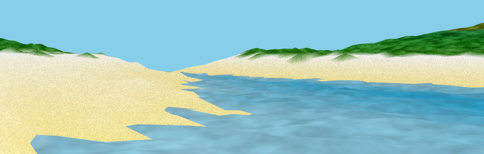
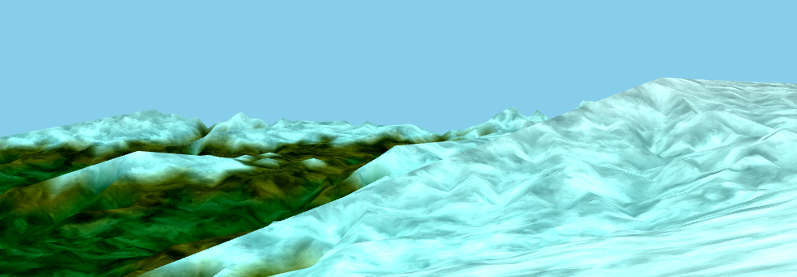

# Dreambuggy

Drive dreambuggy on mountains, snow and sand. Fly dreambird.

Supports USB gamepads. You may need to unplug and replug it in after reloading the page for your browser to recognize it. Raise an issue if yours doesn't work.

## Play in your browser

[][demo]
[][demo]

[demo]: http://kfish.github.io/dreambuggy/

## Build Locally

After installing [the Elm Platform](https://github.com/elm-lang/elm-platform),
run the following sequence of commands:

```bash
git clone https://github.com/kfish/dreambuggy.git
cd dreambuggy
elm-get install
elm-make src/Main.elm --output build/Main.js
elm-reactor
```

And then open [http://localhost:8000/index.html](http://localhost:8000/index.html) to see it in action!

## Credits

Built with [Elm](http://elm-lang.org/).

This demo includes the following shaders:

  * [Fire](https://www.shadertoy.com/view/Xsl3zN) by 301
